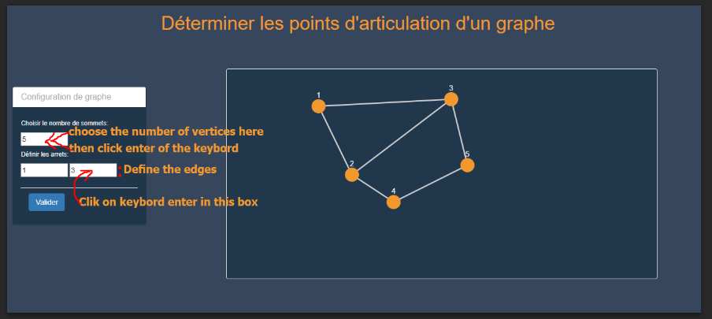
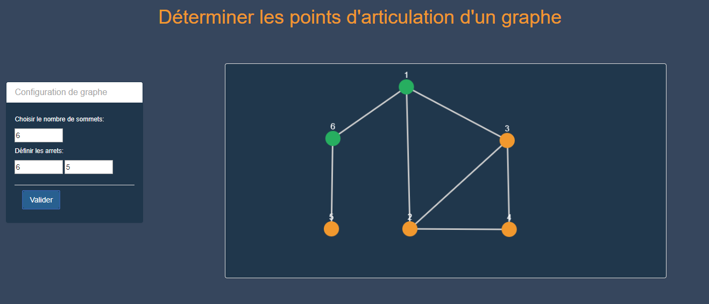

# Determine-the-points-of-articulation-of-a-graph
**Articulation Points** represents vulnerabilities in a network.
In order to find all the articulation points in a given **graph**, 
the brute force approach is to check for every 
vertex if it **is an articulation point or not**, 
by removing it and then counting the number of connected components in the graph.
[https://www.hackerearth.com/practice/algorithms/graphs/articulation-points-and-bridges/tutorial/](Articulation Points and Bridges)

Here an image show how to use process to get articulation points. Finally click on "Valider" to get articulations points.

Int this example the green verties (1 and 6) are the articulation points.
The example is kept from the tutorila shared above read it to get closed idea about articulation points.

 
